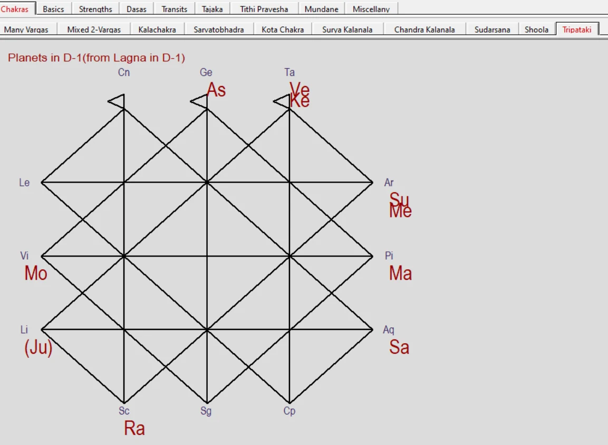

<p align="center">
  
</p>

<p align="center">
  <a href="https://vedastro.org/Jagannatha-Hora-Software.html" target="_blank" rel="noopener noreferrer">
    
  </a>
</p>

<p align="center">
  <strong><a href="https://vedastro.org/blog/JHora-Reverse-Engineered-Part-2-Tripataki-Chart.html">📖 Read the human story: The Line Between Mars and My Moon</a></strong>
</p>

# Tripataki Chart — Jagannatha Hora Reverse Engineered

Retrieve a natal Lagna and planetary signs through simple HTTPS requests, arrange them with JHora's recovered Tripataki D-1 placement logic, and generate the twelve-sign lattice as an SVG—all with one dependency-free JavaScript file.



## What was actually recovered?

This repository reproduces the JHora screen explicitly labelled **“Planets in D-1 (from Lagna in D-1)”**. It is the natal D-1 display mode of the Tripataki view—not a claim that an annual Varshaphala progression has been calculated.

The implementation is based on the real native program rather than a diagram guessed from screenshots:

- The registered MFC view class is `CTripatakiChakraView`.
- Native renderer `FUN_00481670` contains the lattice drawing and label-collision machinery.
- Recovered routine `FUN_00491150` exposes the twelve-sector coordinates and five native object-group branches.
- The first sector is seeded from the Lagna sign; the remaining eleven signs advance in zodiac order around JHora's fixed anchors.
- Planets are assigned by their sign relative to Lagna, with collision ordering when multiple bodies occupy one sector.
- The native groups are planets, Trisphuta, upagrahas, special lagnas and 36 Sahama slots. This small public example intentionally stays with the visible nine-planet D-1 mode.

This is one feature from VedAstro's full-binary recovery of the 32-bit x86 JHora executable: **7,535 functions inventoried, 7,533 recovered as C-like decompilation, and the remaining two preserved as complete assembly**.

## Important scope distinction

Traditional literature also describes Tripataki as a technique used in annual Varshaphala interpretation, often with age-based progressions and special attention to vedha on the Moon or annual Lagna. JHora contains a wider Tajaka/annual-chart system, but that is not what the screenshot or this example displays.

This repository therefore does exactly what its evidence supports:

1. obtains natal sidereal positions;
2. places Gemini—or whichever sign contains the Lagna—at JHora's first anchor;
3. rotates all twelve signs through the recovered lattice order;
4. places Lagna and the nine planets by relative sign; and
5. writes a viewable `tripataki-chart.svg`.

## Run the JavaScript example

You need [Node.js 18 or newer](https://nodejs.org/). There are no packages to install and no API key is required.

```bash
git clone https://github.com/VedAstro/Tripataki-Chart-Jagannatha-Hora-Reverse-Engineered.git
cd Tripataki-Chart-Jagannatha-Hora-Reverse-Engineered
npm start
```

The command prints the complete lattice model as JSON and creates `tripataki-chart.svg` in the current folder. Edit `birthDetails` near the top of [`index.js`](./index.js) to use another birth date, time, UTC offset and location.

The default example reproduces the supplied Gemini-Lagna chart:

```text
Reference sign: Gemini
Moon: Virgo, relative sector 4
Mars: Pisces, relative sector 10
Sun and Mercury: Aries, relative sector 11
Venus and Ketu: Taurus, relative sector 12
```

## The HTTPS data flow

The example calls two public VedAstro calculators in parallel:

```text
POST https://api.vedastro.org/api/Calculate/AllPlanetRasiSigns
POST https://api.vedastro.org/api/Calculate/AllHouseRasiSigns
```

Both receive this shape:

```json
{
  "Ayanamsa": "LAHIRI",
  "Time": {
    "StdTime": "12:44 23/04/1994 +08:00",
    "Location": {
      "Name": "Ipoh, Malaysia",
      "Longitude": 101.0833,
      "Latitude": 4.5833
    }
  }
}
```

To use readable GET routes instead:

```bash
npm run start:get
```

The API provides the astronomical D-1 data. The small transformation in `buildTripataki()` applies the recovered JHora view logic to that data; `renderSvg()` draws the native-style lattice.

## Reading the visible geometry

In the default chart, the Moon occupies Virgo on the left and Mars occupies Pisces directly opposite it on the right. A horizontal lattice line joins those anchors. Traditional Tripataki readers describe such a line as a Mars vedha to the Moon and may associate it with pressure, competition, impatience or emotional agitation.

That is an interpretive rule, not a deterministic prediction. Planetary strength, lordship and the wider natal or annual context matter. Major claims—especially claims about illness, accidents or disaster—should never be made from this diagram alone.

## Files

- [`index.js`](./index.js) — API calls, recovered relative-sign placement and SVG renderer.
- [`assets/tripataki-chart-jhora.webp`](./assets/tripataki-chart-jhora.webp) — optimized reference screenshot.
- [`LICENSE`](./LICENSE) — MIT License.

## Try the full interface

Open [JHora Online](https://vedastro.org/Jagannatha-Hora-Software.html), enter the birth details, select **Chakras**, and choose **Tripataki**.

## Disclaimer

Astrology is a traditional interpretive practice, not a scientifically validated method of prediction. This project is published for education, software preservation and reproducible technical research.
